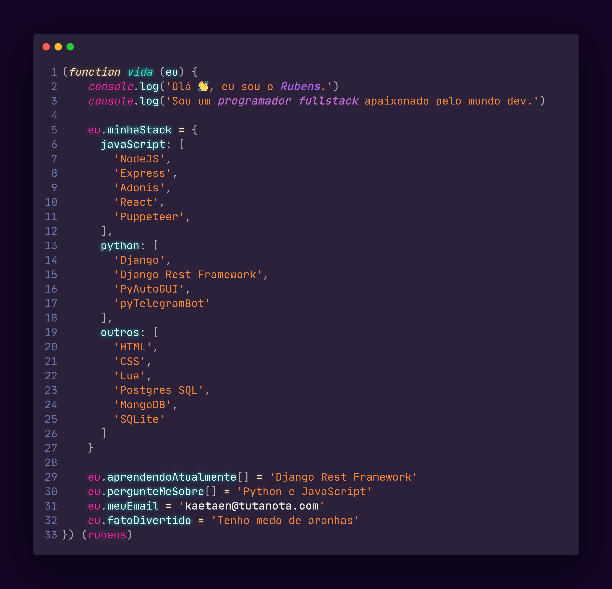

<h1 align="center">Olá, me chamo Rubens 👨🏿‍💻 </h1>
<h1 align="center">Seja muito bem vindo(a) ao meu github 💙 </h1>
  

  

  
  

<!--
(function vida (eu) {
    console.log('Olá 👋, eu sou o Rubens.')
    console.log('Sou um programador fullstack apaixonado pelo mundo dev.')   
  
    eu.minhaStack = {
      javaScript: [
        'NodeJS',
        'Express',
        'Adonis',
        'React',
        'Puppeteer',
      ],
      python: [
        'Django',
        'Django Rest Framework',
        'PyAutoGUI',
        'pyTelegramBot'
      ],
      outros: [
        'HTML',
        'CSS',
        'Lua',
        'Postgres SQL',
        'MongoDB',
        'SQLite'
      ]
    }

    eu.aprendendoAtualmente[] = 'Django Rest Framework'
    eu.pergunteMeSobre[] = 'Python e JavaScript'
    eu.meuEmail = 'kaetaen@tutanota.com'
    eu.fatoDivertido = 'Tenho medo de aranhas'
}) (rubens)
-->
