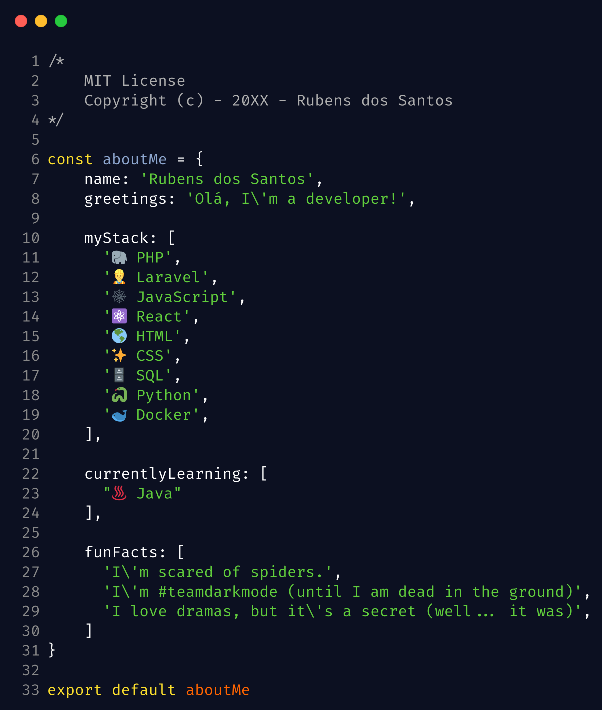

<h1 align="center">Olá, me chamo Rubens 👨🏿‍💻 </h1>
<h1 align="center">Seja muito bem vindo(a) ao meu GitHub ♥️ </h1>
  

  

  
  

<!--

function sobre_mim(Array $eu)
{
    echo 'Olá 👋, eu sou o Rubens'.PHP_EOL;
    echo 'Sou um desenvolvedor web apaixonado pelo mundo dev'.PHP_EOL;

    $eu['minha_stack'] = [
      'PHP'         => 'Laravel',
    	'JavaScript'  => 'NodeJS, ReactJS e React Native',
    	'Outros'      => 'Python, SQL, HTML, CSS, Docker'
  	];

  	$eu['contatos'] = [
    	'email'           => 'rubensdossantos.dev@gmail.com',
    	'linkedin'        => 'https://www.linkedin.com/in/kaetaen',
    	'pagina_pessoal'  => 'https://kaiten.netlify.app/'
  	];

  	$eu['citacao_preferida'] = 'Não há conhecimento que não tenha valor.';
    $eu['fato_divertido'] = 'Fanático por animes e afins XD'
};

-->
